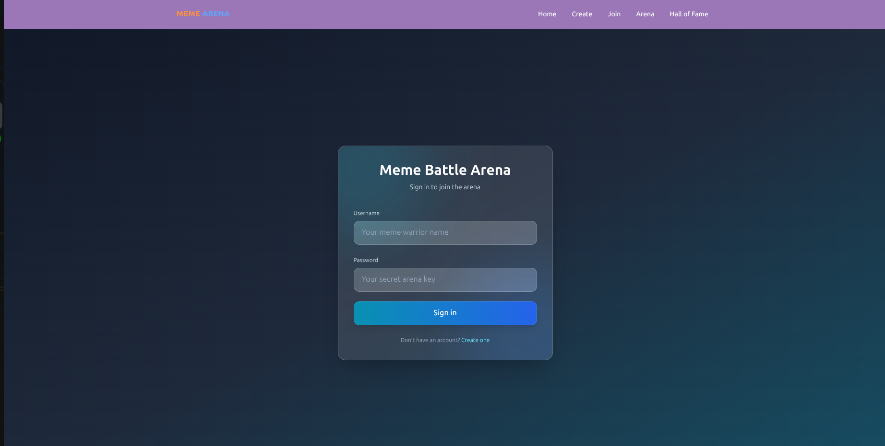
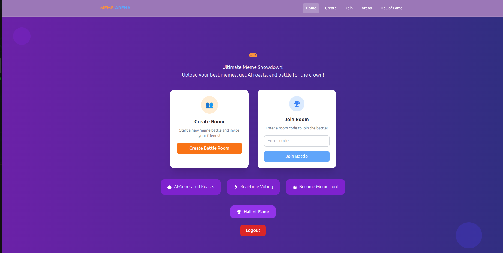
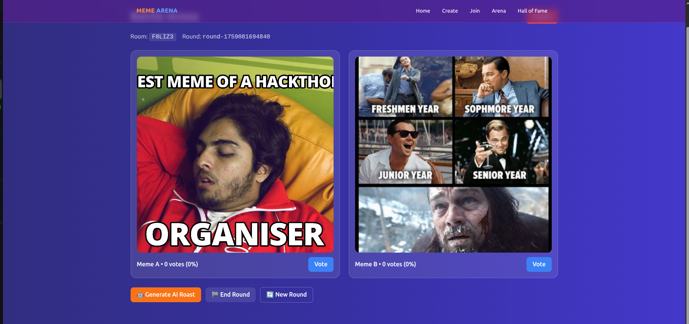

# 🏆 OOTY-FUNDS_MEME-BATTLE-ARENA

A real-time meme battle platform built with **Node.js, Express, and MongoDB**, featuring AI-generated captions, voting, and dynamic leaderboards. Users can upload memes, vote in battles, and track top performers in real-time using **Socket.IO**.

---

## 📸 Demo Images
  
  
  

---

## ✨ Features

- **Real-time Meme Battles** with Socket.IO 🌐  
- **AI-Generated Captions** for memes (via OpenAI or custom AI) 🤖  
- **Voting System** to determine winners in battle rooms 🗳️  
- **Dynamic Leaderboards** for top users and meme creators 📊  
- **JWT Authentication** for secure login/signup 🔐  
- **Responsive Design** for web and mobile access 📱  

---

## 🏗️ Tech Stack

| Category | Technology | Purpose |
| :--- | :--- | :--- |
| **Frontend** | React.js (or any client consuming APIs) | User Interface and interaction |
| **Backend** | Node.js, Express.js | API server and business logic |
| **Database** | MongoDB | Storing users, memes, and battle data |
| **Real-Time** | Socket.IO | Instant battle updates, voting, and notifications |
| **Auth** | JWT | Secure user authentication and authorization |
| **AI** | Gemini | Generating creative meme captions |

---

## 📊 System Flow Diagram

```mermaid
graph TD
    User[User] -->|Uploads Meme| Backend[Server]
    Backend --> AI[AI Caption Generator]
    AI --> Battle[Battle Arena]
    Battle --> Users[Other Users]
    Users -->|Vote| Battle
    Battle --> Leaderboard[Leaderboard]
    Leaderboard --> User
